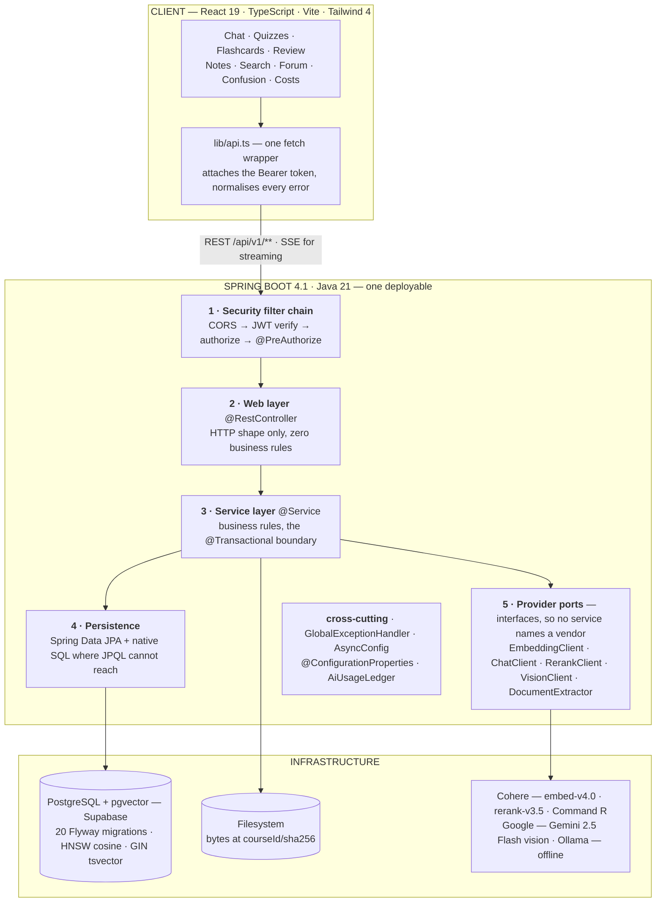
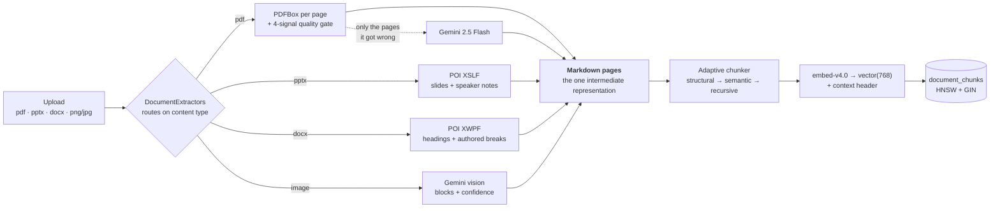
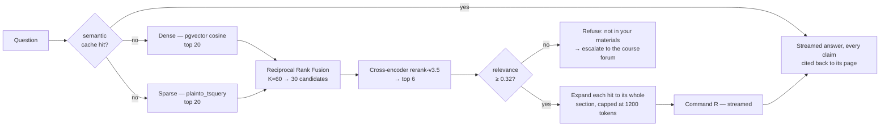

# StudyLoop — AI Course Companion

> Upload your course materials once. StudyLoop becomes a course-scoped tutor that answers **only from your lectures, with page-level citations**, says *"not in your materials"* when it can't, generates quizzes and flashcards from your own slides, schedules your revision — and shows the instructor exactly where the class is confused.


---

## 1. Executive Summary

### Problem statement

A university course arrives as scattered artefacts: lecture PDFs, slide decks, Word handouts, a
whiteboard photographed at the end of class, and a student's own handwriting. Nothing indexes them
together. Generic chatbots answer from the open internet rather than from *this* course, and they
answer confidently when they should decline. Instructors, meanwhile, learn which lecture confused
the class only when the midterm is marked.

### Solution

**StudyLoop** is a course-scoped RAG platform built on Spring Boot and PostgreSQL + pgvector. A
**course space** holds every material for one course; ingestion converts each of them — whatever the
format — into the same structure-aware Markdown pages, chunks them on their own section boundaries,
and embeds them. Retrieval runs dense and sparse search in parallel, fuses them, reranks with a
cross-encoder, and expands each hit to the whole section it came from before the model reads it.
Every answer carries clickable `[n]` citations back to the page it came from, and a calibrated
confidence gate refuses rather than invents.

Everything downstream of retrieval — quizzes, flashcards, an SM-2 revision queue, document
summaries, a confusion heatmap and a class forum whose accepted answers are embedded back into the
corpus — reuses the same grounded context.

### Why not just ChatGPT?

| Generic chatbot | StudyLoop |
|---|---|
| Answers from the open internet | Answers **only from the course corpus**, cited as `[Lecture 7, p. 12]` |
| Hallucinates confidently | Refuses below a **calibrated relevance threshold** — 6 of 8 deliberately unanswerable questions declined, 0 of 52 real ones |
| Can't test you on *your* slides | Quizzes and flashcards generated from selected lectures |
| No revision planning | SM-2 spaced repetition seeded by *your* wrong answers |
| Forgets your handwriting | Photographed notes become searchable, citable documents |
| Tells the teacher nothing | Anonymised confusion heatmap per lecture and topic |
| Quality is a vibe | Quality is a **number** — Recall@6, MRR and nDCG on a fixed 60-question set, re-run per change |

---

## 2. Feature Set

Twenty Flyway migrations, 408 backend tests — the integration ones against real Postgres + pgvector.

| Capability | What it does |
|---|---|
| **Accounts** | Register, log in, stay signed in. BCrypt, JWT access + refresh, role checks on every endpoint. |
| **Course spaces** | Owners, instructors and members. Invite by share link or email; links revocable and expiring. |
| **Material ingestion** | PDF, PowerPoint and Word, extracted asynchronously without blocking the page. Duplicates rejected by content hash, not filename. |
| **Handwritten notes** | Photograph a page; it becomes a document like any other. Private to you until a manager promotes it to the course. |
| **Grounded answers** | Hybrid retrieval → rerank → section expansion → streamed answer with `[n]` citations and conversation memory. |
| **Refusal** | Below the relevance gate, StudyLoop says *"not in your materials"* instead of guessing. |
| **Citation viewer** | Clicking a citation opens that document at that page. |
| **Formatted answers** | Tables, headings, syntax-highlighted code and typeset mathematics. Citations stay clickable inside all of it; model HTML is never rendered. |
| **Quizzes** | MCQ and short-answer generated from chosen lectures, auto-graded with per-answer explanations. |
| **Flashcards** | Generated from a document, or saved from any answer worth keeping. |
| **Revision queue** | SM-2 schedule. Wrong answers enrol themselves; the app tells you what is due today. |
| **Document summaries** | A summary and key-term glossary per document, generated once and cached. |
| **Search** | Passages grouped by document with matched words highlighted — and no confidence gate, because you can judge a weak match yourself. |
| **Confusion heatmap** | Which lectures the class asks about, questions clustered by meaning, and the questions the corpus could not answer at all. |
| **Course forum** | Any refusal escalates to the class. An instructor accepts an answer; the accepted answer is embedded back into the course. |
| **Cost visibility** | Every paid call recorded and priced from the provider's own billing figures, with an admin dashboard by feature and by day. |
| **Answer cache** | Near-identical questions reuse a previous answer. Uploading a document clears the course's cache. |
| **Usage limits** | Per-user request rate limits and a rolling token allowance on everything that costs money. |

---

## 3. Key Innovations & Technical Depth

### 3.1 One extraction interface, four formats, one intermediate representation

`DocumentExtractor` is "bytes in, Markdown pages out". `DocumentExtractors` picks an implementation
from the stored content type; nothing downstream of it names a format.

-   **PDF** — PDFBox page by page, with a line stripper that recovers headings from the document's
    own typography rather than from a word counter.
-   **PPTX** — Apache POI XSLF. **The deck, not a PDF export of the deck.** An export destroys the
    heading hierarchy (the structural chunker then has nothing to cut on), the reading order
    (positioned text boxes come back in paint order — a two-column slide interleaves backwards
    unless shapes are sorted by anchor), and the **speaker notes** entirely, which are usually the
    only prose in a lecture deck.
-   **DOCX** — Apache POI XWPF, matching both Word's style *ids* and localised display names.
    A `.docx` has no pages: Word computes them at layout time, so the file carries only breaks the
    author forced. Those are what get counted, and a document with none is one page. Numbering
    sections and calling them pages would print "page 4" on a citation for something Word prints on
    page 11.
-   **Images** — Gemini vision, below.

Because Markdown is the intermediate representation, a slide title *is* an `#` heading. Adding three
formats required **no change** to chunking, embedding, retrieval, citation, quizzes, flashcards or
the evaluation harness.

| Uploaded | A "page" is | A citation reads | Provider calls |
|---|---|---|---|
| `.pdf` | a page | `week4.pdf, p.12` | 0, or 1 per badly-extracted page |
| `.pptx` | a slide | `Slide 12: Amortized Analysis` | 0 |
| `.docx` | an authored page break | `Graph Algorithms > Bellman-Ford` | 0 |
| `.png` / `.jpg` | the photo | the writer's own heading | 1 |

Legacy `.ppt` and `.doc` are **refused with an explanation**, not half-supported: they are a
different container, and partial support means a deck that uploads cleanly with its speaker notes
silently missing.

### 3.2 Adaptive, structure-aware chunking

Three tiers, in order of how much the document tells us about itself:

1.  **Structural** — cut on the document's own headings. A section that fits becomes one chunk at
    its natural size, 80 tokens or 460; nothing is padded or sliced to hit a number. The 500-token
    ceiling exists only for the runaway case, and sections under 120 tokens merge with the next
    sibling, never across an H1.
2.  **Semantic** — for documents with no headings at all: embed sentences, cut where adjacent
    similarity drops.
3.  **Recursive** — paragraph-boundary fallback, still carrying its heading path.

Two refinements that each earned their place: the **context header** prepends the title and heading
path to the *embedded* text (a passage reading "the expected search time is O(log n)" is a good
passage and a hopeless index entry), and **section expansion** hands the model the whole section a
hit came from — matching happens on small passages, answering on whole ones.

### 3.3 Hybrid retrieval, fused and reranked

-   **Dense** — pgvector HNSW cosine over `embed-v4.0` vectors, Matryoshka-truncated to 768-d.
-   **Sparse** — PostgreSQL full-text over a generated `tsvector` column with a GIN index.
-   **Fusion** — Reciprocal Rank Fusion, K = 60. The fusion loop takes `List<List<ChunkHit>>`, so it
    is agnostic to how many ranked lists it is handed — which is how Phase 17 adds a fourth.
-   **Rerank** — Cohere `rerank-v3.5` reads the question *against* each of 30 candidates.
    Reranking six chunks can only reorder six; the passage RRF put eleventh is the one this stage
    exists to promote.

### 3.4 Refusal on a calibrated signal

The gate reads the cross-encoder's relevance, not cosine similarity, because a cross-encoder score
is calibrated 0..1 — **it means the same thing for every question**, which a cosine does not. On the
current corpus the eight unanswerable questions score 0.021 … 0.347 and the lowest *answerable* one
scores 0.331, so the threshold sits at **0.32**, in the ~0.010 gap between them.

The threshold is a property of the chunking, not of the model: it was 0.25 until structure-aware
chunking moved both ends toward each other from the outside. Left at 0.25 it would now refuse four
of eight instead of six, purely because the pipeline underneath it improved.

### 3.5 Vision extraction as a router, not a policy

Every PDF page is scored on four measurements after PDFBox reads it, and **only the pages PDFBox
demonstrably failed on** — a scan, a broken font encoding, a two-column layout, a page whose
substance is a diagram — are re-read by Gemini 2.5 Flash.

On the bundled 306-page textbook that is **21 pages**. A clean digital document routes nothing and
pays nothing, so the feature costs four cheap measurements per page on material that does not need
it. A per-document cap refuses an oversized scan outright rather than routing the first 40 pages and
stopping — a truncated document reaches READY with the right page count and no answers past page 40,
and every symptom of that is silence.

### 3.6 Handwritten notes, with the model's uncertainty kept visible

Digitising handwriting is a commodity; the useful part is what happens next. Here the note **is** a
`Document`, so the moment it is READY it is chattable, quizzable, flashcard-able and citable.

The model returns **blocks, each with a confidence** (enforced JSON). Blocks under 0.6 are stored,
shown, and **not indexed** — and leave no marker in the indexed text, because a marker would itself
be embedded and cited. Both halves are deliberate:

-   **Not indexed**, because a half-guessed recurrence relation reads exactly like a correct one and
    would be cited back to the student as their own note.
-   **Still shown**, because a dropped line nobody is told about is indistinguishable from a line
    that was never on the page.

Visibility is a column on `documents`, not a pipeline: a note is `OWNER` until a manager promotes it
to `COURSE`. Adding that column changed the meaning of every existing query — the filtered list is
the one you remember to write, and `findById` is the one that leaks; four such holes were found and
closed, each covered by a test that drives the endpoint as a *classmate*, because a test written as
the owner passes either way. An export to compilable LaTeX keeps the direction Markdown storage gave
up reachable.

### 3.7 The knowledge loop

A refusal is not a dead end: it escalates to the course forum, anyone may answer, an instructor
accepts one, and **the accepted answer is embedded back into the corpus** — so the next student to
ask gets it from the assistant instead.

### 3.8 Cost, cache and quotas

Every provider call is recorded with its token counts and priced from the provider's own billing
figures. A semantic cache serves near-identical questions from a previous answer and is invalidated
per course on upload. Per-user rate limits and a rolling token allowance sit on every path that
costs money, with a separate, tighter limit on the ingest path.

---

## 4. Measured Retrieval Quality

The distinguishing claim of this project is that retrieval quality is a **number**, produced by a
harness that ships with the repository.

**The instrument** — 60 questions over 14 open-licensed documents (*Open Data Structures*), tagged
factual / conceptual / synthesis / figure-table, with **8 deliberately unanswerable** to measure
refusal. Scored on Recall@6, MRR and nDCG@6. Each retrieval stage is a config flag, so an A/B is a
property change rather than a rebuild — two pipelines that differ by a code change are not
comparable, because the "before" one no longer exists to be re-measured.

| Pipeline | Recall@6 | MRR | nDCG@6 | Unanswerable refused |
|---|---|---|---|---|
| Baseline — hybrid search, fixed 400-word windows | 0.856 | 0.766 | 0.765 | 0 / 8 |
| **+ cross-encoder reranking** | 0.891 | 0.811 | 0.796 | 5 / 8 |
| **+ structure-aware adaptive chunking** † | **0.939** | **0.813** | **0.828** | **6 / 8** |
| + synthetic query indexing — *measured, shipped **off*** | 0.929 | 0.813 | 0.823 | 6 / 8 |

† measured under a **stricter** grading rule than the row above it: the ±1 page tolerance was
removed in the same run, so a chunk is now credited only for a page it actually covers. The numbers
went up while the ruler got harder.

No false refusals were introduced at any step — all 52 answerable questions were answered in every
run.

**The synthesis questions were the point.** Questions needing two places at once started at 0.600
recall and were the floor throughout; reranking made them *worse* (0.533) by promoting the better of
two passages and pushing the second out of the six. Section-shaped chunks fixed it — 0.783 — because
six 400-word windows held about one and a half sections between them, and six sections hold six.

**The fourth row is why the other three are worth reading.** Generating a question list per section
and indexing it beside the section — the technique that was supposed to close the gap between how a
student asks and how a textbook writes — moved nothing, so it ships behind a flag that is off. The
mechanism, its switches and nineteen tests all stayed; what did not stay is the stage being on.
Reporting only the runs that went up would make the runs that went up worth less.

Reproduce:

```bash
cd backend
./mvnw -B -Deval.golden=true -Deval.reset=true -Dtest=RetrievalEvalTest test
```

```powershell
# PowerShell splits an unquoted -D argument at the dot
cd backend; .\mvnw.cmd -B "-Deval.golden=true" "-Deval.reset=true" "-Dtest=RetrievalEvalTest" test
```

---

## 5. System Architecture

A layered Spring Boot monolith, **packaged by feature rather than by layer**, serving a React SPA
over REST + SSE.



### Ingestion pipeline



### Query pipeline



Editable source diagrams live in [docs/architecture/](docs/architecture/) as `.drawio` files,
openable at [diagrams.net](https://app.diagrams.net).

---

## 6. Module Breakdown

| Module | Package | Responsibilities |
| :--- | :--- | :--- |
| **Auth & security** | `auth/`, `security/` | Registration, BCrypt, JWT access + refresh, stateless filter chain, method-level roles |
| **Course spaces** | `course/` | Owners / instructors / members, invites by link and email, the membership gate every other feature calls |
| **Ingestion** | `document/` | Format routing, extraction (PDFBox · POI · Gemini), page quality gate, adaptive chunking, embedding, content-addressed storage, summaries, handwritten notes and LaTeX export |
| **Retrieval** | `retrieval/` | Dense + sparse search, RRF fusion, cross-encoder reranking, section expansion, highlighted snippet search |
| **Chat** | `chat/` | Grounded answers, SSE streaming, citations, conversation memory, semantic answer cache, the refusal gate |
| **Assessment** | `quiz/`, `flashcard/`, `review/` | Quiz generation and auto-grading, flashcards, SM-2 spaced repetition |
| **Knowledge loop** | `forum/` | Escalated refusals, accepted answers embedded back into the corpus |
| **Analytics** | `analytics/` | Question clustering by meaning, per-lecture confusion heatmap, unanswered questions |
| **Cost & limits** | `usage/` | Token ledger priced from provider billing, rate limits, rolling quotas, admin cost dashboard |
| **Configuration** | `config/`, `common/` | `@ConfigurationProperties` for every tunable, one JSON error shape for every failure |
| **Evaluation** | `test/…/retrieval/eval/` | Golden set, corpus seeding, Recall@k · MRR · nDCG, the reproducible eval report |

---

## 7. Technology Stack

### Backend & AI

-   **Framework** — Java 21, Spring Boot 4.1 (Web MVC, Security, Data JPA, Validation, Actuator)
-   **Database** — PostgreSQL on Supabase with **pgvector**; Flyway migrations `V1`–`V20`
-   **Embeddings** — Cohere `embed-v4.0` truncated to 768-d; Google `gemini-embedding-001` and
    local Ollama `qwen3-embedding` as swappable adapters
-   **Reranking** — Cohere `rerank-v3.5` cross-encoder
-   **Generation** — Cohere Command R, called directly over Spring's `RestClient`
-   **Vision** — Google Gemini 2.5 Flash, for badly-extracted PDF pages and handwritten notes
-   **Extraction** — Apache PDFBox 3 (PDF), Apache POI 5.5 (XSLF slides / XWPF documents)

### Frontend

-   **Framework** — React 19 + Vite 8 + TypeScript, React Router 7
-   **Styling** — Tailwind CSS 4
-   **Rendering** — `react-pdf` citation viewer; `react-markdown` with KaTeX maths, `highlight.js`
    code blocks and clickable citations preserved inside tables

### Quality

-   **Testing** — JUnit 5 + MockMvc, integration tests against a **second Supabase project** used
    only by the suite
-   **CI/CD** — GitHub Actions: build + test on every push, both Docker images built in CI

---

## 8. Getting Started

### Prerequisites

-   JDK 21+
-   Node.js 20+
-   A free [Supabase](https://supabase.com) project with the `vector` extension enabled

### Backend

1.  Create `backend/.env.properties` (git-ignored) with your Supabase **session pooler**
    credentials:

    ```properties
    DB_URL=jdbc:postgresql://<your-pooler-host>:5432/postgres
    DB_USERNAME=postgres.<your-project-ref>
    DB_PASSWORD=<your-db-password>
    JWT_SECRET=<any random string, >= 32 bytes>
    COHERE_API_KEY=<free key from dashboard.cohere.com/api-keys>
    GOOGLE_API_KEY=<free key from aistudio.google.com/apikey>
    ```

2.  Run it:

    ```bash
    cd backend
    ./mvnw spring-boot:run
    ```

3.  Verify: `http://localhost:8080/actuator/health` → `"status": "UP"` with `db: UP`.

Flyway applies the schema on first boot. Keys degrade gracefully rather than crashing:

| Key | Without it |
|---|---|
| `COHERE_API_KEY` | Chunks are stored without vectors; search falls back to full-text; chat returns a clear 502 |
| `GOOGLE_API_KEY` | PDFs still ingest — bad pages are simply indexed as extracted; **photographed notes fail**, since that page is the vision model and nothing else |
| *neither* | PPTX and DOCX still ingest fully; they make no provider call at all |

### Frontend

```bash
cd frontend
npm install
npm run dev            # http://localhost:5173
```

---

## 9. Deployment

Both apps ship as Docker images (`backend/Dockerfile`, `frontend/Dockerfile`), built in CI on every
push to verify they are deployable. A typical cloud setup (Railway/Render + Supabase):

-   **Database** — a Supabase Postgres project with `vector`; Flyway applies the schema on first
    boot.
-   **Backend** — deploy `backend/` as a Docker service with a **persistent disk mounted at
    `/data`** so uploaded bytes survive restarts.

    | Variable | Purpose |
    |---|---|
    | `DB_URL`, `DB_USERNAME`, `DB_PASSWORD` | Supabase session-pooler credentials |
    | `JWT_SECRET` | HMAC signing key, ≥ 32 bytes |
    | `COHERE_API_KEY` | embeddings, reranking and chat |
    | `GOOGLE_API_KEY` | vision extraction and handwritten notes |
    | `CORS_ALLOWED_ORIGINS` | the deployed frontend origin (comma-separated) |
    | `DOCUMENTS_DIR` | defaults to `/data/documents` in the image |

-   **Frontend** — build with `--build-arg VITE_API_URL=https://<your-backend-host>` (Vite inlines
    it at build time), then serve the resulting nginx image.

`/actuator/health` is the platform health check.

---

## 10. Status & Roadmap

### Honest limits

-   **No public instance.** It runs locally; images are built on every push but nothing is hosted.
-   **Diagrams are invisible to search.** A figure or table is found only through the text around
    it — Phase 17 is exactly this.
-   **Bangla is unreliable.** Bangla PDFs frequently extract as garbage, so answers over them are
    not trustworthy yet.
-   **Legacy `.ppt` / `.doc` are refused** by design, and Markdown files are not accepted — they
    have no page concept at any level.
-   **Starts empty.** No seeded demo course yet — you upload your own material first. The fourteen
    open-licensed chapters in `backend/src/test/resources/fixtures/` are a ready-made corpus if you
    want one.

### Next

| Phase | Work |
|---|---|
| **17 — Multimodal retrieval** | Figures and tables embedded as images and fused in as a fourth ranked list, so "the diagram with the three layers" finds the page |
| **18 — Query understanding** | Trigram matching for typos, conditional multi-query and HyDE, intent-conditional thresholds — with a refusal alarm so recall gains cannot quietly buy hallucinations |
| **19 — Bangla end to end** | Detected on upload, searched with the right language rules, answered in Bangla with citations |
| **20 — Knowledge loop, round 2** | Uploading a document goes back and answers the questions the corpus previously could not |
| **21 — Study guides** | A cited, exportable revision guide generated for any topic, with diagrams |
| **22 — Hardening** | Coverage, material taxonomy and metadata filters, seed data, deployment |

Every retrieval change above lands the same way: measured on the same sixty questions, with the runs
that failed reported alongside the ones that worked.
