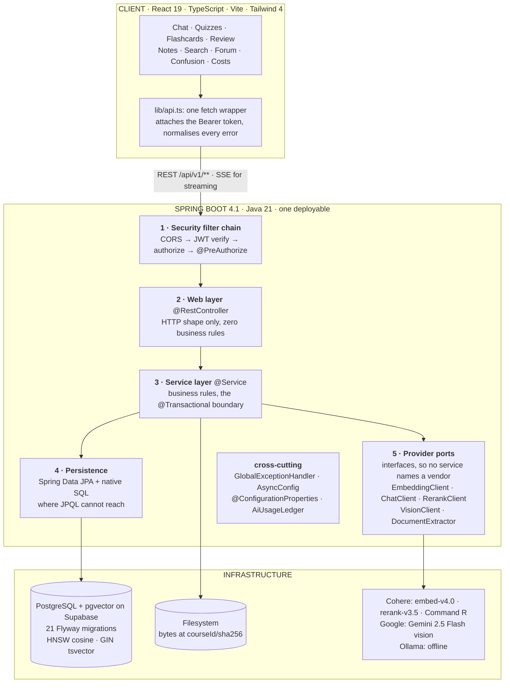
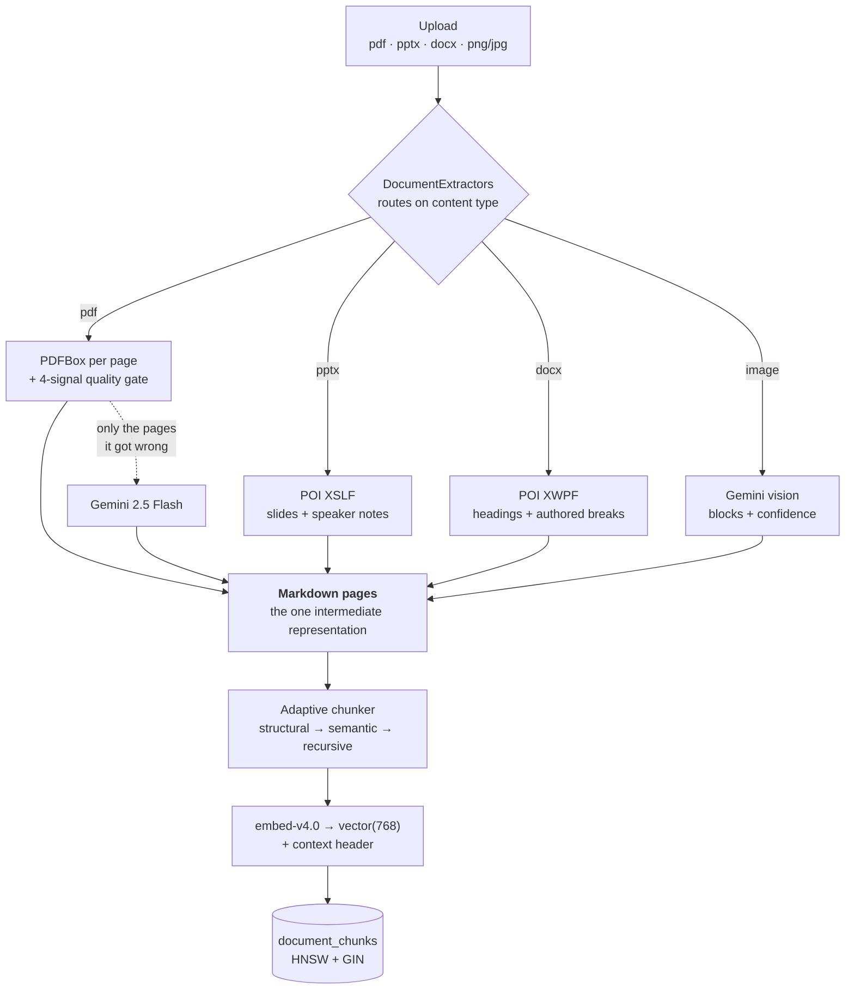
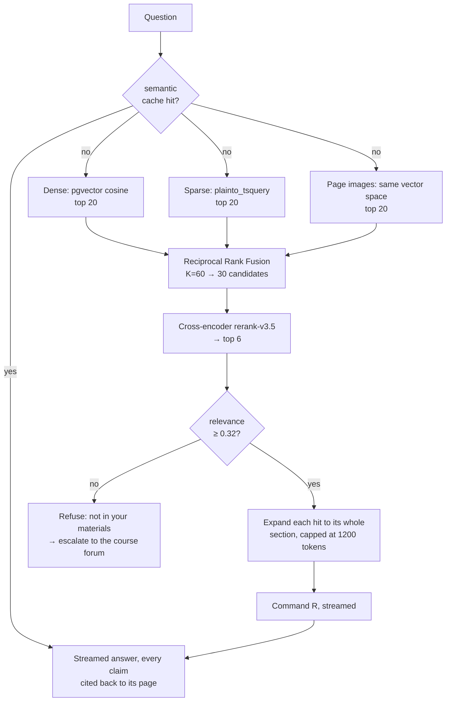

# StudyLoop

> Upload your course materials once. StudyLoop becomes a course-scoped tutor that answers only from
> your lectures, with page-level citations, says *"not in your materials"* when it can't, generates
> quizzes and flashcards from your own slides, schedules your revision, and shows the instructor
> exactly where the class is confused.


---

## 1. Executive summary

### Problem statement

A university course arrives as scattered files. Lecture PDFs, slide decks, Word handouts, a
whiteboard photographed at the end of class, a student's own handwriting. Nothing indexes them
together. Generic chatbots answer from the open internet rather than from *this* course, and they
answer confidently when they should decline. Instructors find out which lecture confused the class
when the midterm is marked, which is too late to do anything about it.

### Solution

StudyLoop is a course-scoped RAG platform built on Spring Boot and PostgreSQL with pgvector. A
course space holds every material for one course. Ingestion converts each of them, whatever the
format, into the same structure-aware Markdown pages, chunks them on their own section boundaries,
and embeds them. Retrieval runs dense and sparse search in parallel, fuses the two ranked lists,
reranks with a cross-encoder, and expands each surviving hit to the whole section it came from
before the model reads it. Every answer carries clickable `[n]` citations back to the page it came
from, and a calibrated confidence gate refuses rather than invents.

Everything downstream of retrieval reuses that same grounded context: quizzes, flashcards, an SM-2
revision queue, document summaries, a confusion heatmap, and a class forum whose accepted answers
are embedded back into the corpus.

### What a general chatbot does not do

| Generic chatbot | StudyLoop |
|---|---|
| Answers from the open internet | Answers only from the course corpus, cited as `[Lecture 7, p. 12]` |
| Answers confidently when it should decline | Refuses below a calibrated relevance threshold: 6 of 8 deliberately unanswerable questions declined, 0 of 56 real ones |
| Cannot test you on your own slides | Quizzes and flashcards generated from the lectures you pick |
| Has no view of what you got wrong | SM-2 spaced repetition seeded by your own wrong answers |
| Cannot read your handwriting into anything | Photographed notes become searchable, citable documents |
| Tells the instructor nothing | Anonymised confusion heatmap per lecture and topic |
| Quality is a matter of opinion | Quality is a number: Recall@6, MRR and nDCG over a fixed question set, re-run on every change |

---

## 2. Feature set

Twenty-five Flyway migrations and 536 backend tests, the integration ones running against a real
Postgres with pgvector rather than an in-memory stand-in.

| Capability | What it does |
|---|---|
| **Accounts** | Register, log in, stay signed in. BCrypt, JWT access + refresh, role checks on every endpoint. |
| **Course spaces** | Owners, instructors and members. Invite by share link or email; links revocable and expiring. |
| **Material ingestion** | PDF, PowerPoint and Word, extracted asynchronously without blocking the page. Duplicates rejected by content hash, not filename. |
| **Handwritten notes** | Photograph a page and it becomes a document like any other. Private to you until a manager promotes it to the course. |
| **Grounded answers** | Hybrid retrieval, then rerank, then section expansion, then a streamed answer with `[n]` citations and conversation memory. |
| **Figures are searchable** | Pages carrying a diagram or a table are embedded as pictures into the same vector space as the text, so a question about a drawing finds the page it is on. |
| **Refusal** | Below the relevance gate, StudyLoop says *"not in your materials"* instead of guessing — in the language the question was asked in. |
| **Bangla** | A Bangla document is detected on the way in by the script it is written in, cut at its own sentence boundaries, matched by a retriever that can see through its case suffixes, and answered in Bangla. |
| **Citation viewer** | Clicking a citation opens that document at that page. |
| **Formatted answers** | Tables, headings, syntax-highlighted code and typeset mathematics. Citations stay clickable inside all of it; model HTML is never rendered. |
| **Quizzes** | MCQ and short-answer generated from chosen lectures, auto-graded with per-answer explanations. |
| **Flashcards** | Generated from a document, or saved from any answer worth keeping. |
| **Revision queue** | SM-2 schedule. Wrong answers enrol themselves; the app tells you what is due today. |
| **Document summaries** | A summary and key-term glossary per document, generated once and cached. |
| **Search** | Passages grouped by document with matched words highlighted. No confidence gate here, because you can judge a weak match yourself. |
| **Confusion heatmap** | Which lectures the class asks about, questions clustered by meaning, and the questions the corpus could not answer at all. |
| **Course forum** | Any refusal escalates to the class. An instructor accepts an answer; the accepted answer is embedded back into the course. |
| **Corpus watch** | Uploading a document re-asks the course's open forum threads and answers the ones it just made answerable. The reply is labelled, the thread stays open, and it can never become course material itself. |
| **General knowledge** | A refusal offers one explicit way out: the same question answered from outside the materials, visibly marked, with no citations — and counted, so the instructor can see which gaps students worked around. |
| **Video explanations** | A narrated, captioned video built from the course's own passages: animated where movement explains something, and every scene carrying the citation it was written from. A topic the corpus cannot support is refused before anything renders. Optional — the renderer is a separate container, and without it the feature is absent rather than broken. |
| **Cost visibility** | Every paid call recorded and priced from the provider's own billing figures, with an admin dashboard by feature and by day. |
| **Answer cache** | Near-identical questions reuse a previous answer. Uploading a document clears the course's cache. |
| **Usage limits** | Per-user request rate limits and a rolling token allowance on everything that costs money. |

---

## 3. Key innovations and technical depth

### 3.1 One extraction interface, four formats, one intermediate representation

`DocumentExtractor` is "bytes in, Markdown pages out". `DocumentExtractors` picks an implementation
from the stored content type, and nothing downstream of it names a format.

PDFs go through PDFBox page by page, with a line stripper that recovers headings from the document's
own typography rather than from a word counter.

Slide decks go through Apache POI XSLF, and they go through it as decks rather than as PDF exports
of decks. An export destroys the heading hierarchy, which leaves the structural chunker with nothing
to cut on. It destroys the reading order too, because positioned text boxes come back in paint
order, so a two-column slide interleaves backwards unless shapes are sorted by anchor. And it drops
the speaker notes entirely, which in a lecture deck are usually the only prose in the file.

Word documents use POI XWPF, matching both Word's style ids and their localised display names. A
`.docx` has no pages. Word computes them at layout time, so the file carries only the breaks the
author forced, and those are what get counted; a document with none is one page. The alternative,
numbering sections and calling them pages, would print "page 4" on a citation for something Word
prints on page 11.

Images go to Gemini vision, covered below.

Because Markdown is the intermediate representation, a slide title is an `#` heading. Adding three
formats required no change to chunking, embedding, retrieval, citation, quizzes, flashcards or the
evaluation harness.

| Uploaded | A "page" is | A citation reads | Provider calls |
|---|---|---|---|
| `.pdf` | a page | `week4.pdf, p.12` | 0, or 1 per badly-extracted page |
| `.pptx` | a slide | `Slide 12: Amortized Analysis` | 0 |
| `.docx` | an authored page break | `Graph Algorithms > Bellman-Ford` | 0 |
| `.png` / `.jpg` | the photo | the writer's own heading | 1 |

Legacy `.ppt` and `.doc` are refused with an explanation rather than half-supported. They are a
different container, and partial support means a deck that uploads cleanly with its speaker notes
silently missing.

### 3.2 Adaptive, structure-aware chunking

Three tiers, in order of how much the document tells us about itself.

1.  Structural chunking cuts on the document's own headings. A section that fits becomes one chunk
    at its natural size, 80 tokens or 460; nothing is padded or sliced to hit a number. The
    500-token ceiling exists only for the runaway case, and sections under 120 tokens merge with the
    next sibling, never across an H1.
2.  Semantic chunking handles documents with no headings at all: embed sentences, cut where adjacent
    similarity drops.
3.  Recursive chunking is the paragraph-boundary fallback, still carrying its heading path.

Two smaller pieces do more work than they look like they should. The context header prepends the
title and heading path to the *embedded* text, because a passage reading "the expected search time
is O(log n)" is a good passage and a hopeless index entry. Section expansion then hands the model
the whole section a hit came from, so matching happens on small passages and answering happens on
whole ones.

### 3.3 Hybrid retrieval, fused and reranked

Dense search is pgvector HNSW cosine over `embed-v4.0` vectors, Matryoshka-truncated to 768
dimensions. Sparse search is PostgreSQL full-text over a generated `tsvector` column with a GIN
index. A third list searches page images, described below. Reciprocal Rank Fusion combines them with
K = 60, and the fusion loop takes `List<List<ChunkHit>>`, so it does not care how many ranked lists
it is handed; adding the third one was a caller change.

Cohere `rerank-v3.5` then reads the question against each of 30 candidates. Reranking six chunks can
only reorder six; the passage RRF put eleventh is the one this stage exists to promote.

The sparse half is weaker than that description makes it sound, and the measurement is recent.
`plainto_tsquery` joins a question's words with AND, so a chunk has to contain all of them; on the
fourteen-chapter evaluation corpus that means it returns nothing at all for 46 of 56 questions, and
the dense half has been carrying those on its own. Graded against the same pages, that retriever
scores recall@6 0.116; the same query with its terms OR-ed scores **0.884**, and a trigram retriever
matching inside words scores 0.851. All three of those repairs, together with a conditional HyDE
second pass and refusal thresholds chosen by question type, are built and tested behind flags in
`RetrievalProperties.Stages`, and every one of them is switched **off**: the evaluation run that
would justify enabling any of them has not been made, and a stage without its run does not ship on.

Every vector search here is a filtered one, scoped to a course, to ready documents, to what the
asking member may see, and to a modality. An HNSW index knows none of that: it returns its nearest
neighbours and the filters run on what it already chose, so a course whose pages are not in the
whole database's top forty gets fewer candidates than it asked for. `hnsw.iterative_scan` keeps the
scan walking until enough rows survive the filter. The symptom, before it was found, was retrieval
that got quietly worse as the database grew.

### 3.4 Pages found by what they look like

A diagram is unreachable by a text index, and captioning it is somebody else's job. `embed-v4.0`
takes images into the same vector space it takes text into, so a page with a figure on it is
rendered, embedded as a picture, and searched by the question the student already typed. No second
provider, no second key, no extra column of vectors, no separate query embedding.

Which pages count is decided from measurements the extraction quality gate already took: image
coverage, or path segments for a figure that was drawn rather than pasted. On the fourteen-chapter
fixture corpus that is 84 of 306 pages, so a full rebuild costs about twenty image-embedding calls.
The chunk keeps a copy of its page's text alongside the image vector, because Command R is text-only
and a page found through a picture still has to arrive at the generator as words.

Section 4 has what it did to the numbers, including what it cost.

### 3.5 Refusal on a calibrated signal

The gate reads the cross-encoder's relevance rather than cosine similarity, because a cross-encoder
score is calibrated 0..1 and means the same thing for every question, which a cosine does not. On
the current corpus the eight unanswerable questions score between 0.021 and 0.347, the lowest
*answerable* one scores 0.331, and the threshold sits at 0.32 in the roughly 0.010 gap between them.

That threshold is a property of the chunking, not of the model. It was 0.25 until structure-aware
chunking moved both ends toward each other from the outside. Left at 0.25 it would now refuse four
of eight instead of six, purely because the pipeline underneath it got better.

### 3.6 Vision extraction routes page by page

After PDFBox reads a page, four measurements score how well it did, and only the pages it
demonstrably failed on get re-read by Gemini 2.5 Flash: a scan, a broken font encoding, a two-column
layout, a page whose substance is a diagram.

On the bundled 306-page textbook that comes to 21 pages. A clean digital document routes nothing and
pays nothing, so on material that does not need the feature it costs four cheap measurements per
page and no more. A per-document cap refuses an oversized scan outright instead of routing the first
40 pages and stopping, because a truncated document reaches READY with the right page count and no
answers past page 40, and nothing about that looks like a failure from the outside.

### 3.7 Handwritten notes, with the model's uncertainty kept visible

Plenty of tools digitise handwriting. What matters here is what happens next: the note *is* a
`Document`, so the moment it reaches READY it is chattable, quizzable, flashcard-able and citable.

The model returns blocks, each with a confidence, in enforced JSON. Blocks under 0.6 are stored and
shown, but not indexed, and they leave no marker in the indexed text either, since a marker would
itself be embedded and cited. Both halves of that are deliberate. Keeping them out of the index
matters because a half-guessed recurrence relation reads exactly like a correct one and would come
back cited to the student as their own note. Showing them anyway matters because a dropped line
nobody is told about is indistinguishable from a line that was never on the page.

Visibility is a column on `documents` rather than a pipeline. A note is `OWNER` until a manager
promotes it to `COURSE`. Adding that column quietly changed the meaning of every existing query: the
filtered list is the one you remember to write, and `findById` is the one that leaks. Four such
holes turned up, each now covered by a test that drives the endpoint as a classmate, because a test
written as the owner passes either way. An export to compilable LaTeX keeps the direction that
Markdown storage gave up reachable.

### 3.8 The knowledge loop

A refusal escalates to the course forum. Anyone may answer, an instructor accepts one, and the
accepted answer is embedded back into the corpus, so the next student to ask gets it from the
assistant instead.

It also runs the other way. When a document finishes ingesting, the course's open threads are asked
again through the same retrieval and the same confidence gate, and any the corpus can now answer get
an answer — the question that was refused on Tuesday, answered when the lecture that covers it
arrived. Three rules keep that honest: the thread stays open, because a person has not confirmed
anything; the assistant may reply to a thread once, however many documents arrive; and **its reply
can never be accepted into the corpus**, because a corpus that can absorb its own model's output is
a course teaching itself whatever it first guessed. Only a person's answer can become material.

A refusal also offers a way out for the questions the course was never going to cover. One explicit
click answers it from general knowledge, styled differently, labelled as not coming from the
materials and carrying no citations, since it has none. It is never cached and never written back,
and it is counted: the confusion page reports how many refusals a student cared about enough to ask
a second way, which is a sharper signal about missing material than the refusal count itself.

### 3.9 Generated animation code, executed behind three layers

The animated half of a video is Manim — Python that a language model wrote, which this application
then runs. That is a hazard rather than a feature, and it is allowed only because the sandbox around
it is a deliverable with its own hostile-input suite rather than a comment promising care.

**Layer one is an allow-list over the parsed syntax tree, never a blocklist.** The generated module
must consist of exactly `from manim import *`, one `GeneratedScene` class, and statements built from
a permitted set of node types. No second import, no name or attribute beginning with two
underscores, no `open`, `eval`, `exec`, `getattr`, decorators, `while`, `try` or `with`. Anything
unrecognised is rejected unread. The claim it rests on is stated in the source so that it can be
attacked: *with no import statement and no dunder access, there is no I/O primitive within reach* —
Manim's namespace is the entire vocabulary available to the scene. The canonical Python escape,
`().__class__.__bases__[0].__subclasses__()`, is caught by a rule about spelling rather than by a
rule about that expression, which is the difference between an allow-list and being one attribute
behind the next published trick.

**Layer two is the process**, because a bug in Manim's own tens of thousands of lines is not
something an AST walk can see: a non-root uid, an empty environment (the renderer holds no API key
at all — the backend makes every model call and hands it text), a scratch directory that is the only
writable path, `RLIMIT_CPU`, `RLIMIT_AS`, `RLIMIT_FSIZE` and `RLIMIT_NPROC`, and a wall-clock kill of
the whole **process group**. Killing the child alone is the classic mistake: Manim spawns ffmpeg, and
an orphaned encoder keeps writing after the timeout has reported success.

**Layer three is the network**, removed with `unshare -rn` where the kernel permits it. Where it does
not, the health endpoint says so in words instead of claiming an isolation it does not have — which
is precisely why layer one is an allow-list, since a blocklist that is sometimes the last line of
defence is not a defence.

The tests are attacks, not happy paths: a fork bomb, a ten-gigabyte write, `import os`,
`__import__("os")`, a socket, an infinite loop, a `getattr` into builtins — each asserted rejected or
killed **with the layer that stopped it named**, because a test that only knows the render failed
cannot tell a blocked import from a syntax error.

A scene that loses is not a lost video. It becomes a slide drawn in the product's own palette, the
job records which layer stopped it and what the toolchain said, and the count is displayed: *"6
scenes · 4 animated · 2 rendered as static slides"*. Degradation is acceptable; silent degradation
is the defect.

### 3.10 Cost, cache and quotas

Every provider call is recorded with its token counts and priced from the provider's own billing
figures. A semantic cache serves near-identical questions from a previous answer and is invalidated
per course on upload. Per-user rate limits and a rolling token allowance sit on every path that
costs money, with a separate, tighter limit on the ingest path.

---

## 4. Measured retrieval quality

Retrieval quality here is a number, produced by a harness that ships with the repository.

The instrument is 64 questions over 14 open-licensed documents (*Open Data Structures*), tagged
factual, conceptual, synthesis or figure-table, with 8 deliberately unanswerable so that refusal is
measured too. Scoring is Recall@6, MRR and nDCG@6. Each retrieval stage is a config flag, which
makes an A/B a property change rather than a rebuild. Two pipelines that differ by a code change are
not comparable, because the "before" one no longer exists to be re-measured.

The table is scored over the original 60 questions throughout. Four questions about figures were
added later, and every row would move if the set they were scored against changed underneath them.

| Pipeline | Recall@6 | MRR | nDCG@6 | Unanswerable refused |
|---|---|---|---|---|
| Baseline: hybrid search, fixed 400-word windows | 0.856 | 0.766 | 0.765 | 0 / 8 |
| + cross-encoder reranking | 0.891 | 0.811 | 0.796 | 5 / 8 |
| + structure-aware adaptive chunking † | 0.939 | 0.813 | 0.828 | 6 / 8 |
| + synthetic query indexing (measured, shipped off) | 0.929 | 0.813 | 0.823 | 6 / 8 |
| + page images as a third ranked list | **0.942** | **0.838** | **0.843** | **6 / 8** |

† measured under a stricter grading rule than the row above it. The ±1 page tolerance was removed in
the same run, so a chunk is now credited only for a page it actually covers. The numbers went up
while the ruler got harder.

No false refusals appeared at any step. All 52 answerable questions were answered in every run.

The synthesis questions were the hard case throughout. Questions needing two places at once started
at 0.600 recall and stayed the floor, and reranking made them *worse* (0.533) by promoting the
better of two passages and pushing the second out of the six. Section-shaped chunks fixed it, up to
0.783, because six 400-word windows held about one and a half sections between them and six sections
hold six.

The fourth row measured worse than the third, and it ships that way. Generating a question list per
section and indexing it beside the section was supposed to close the gap between how a student asks
and how a textbook writes. It moved nothing, so it ships behind a flag that is off. The mechanism,
its switches and its nineteen tests all stayed; what did not stay is the stage being on. Reporting
only the runs that went up would make the runs that went up worth less.

The fifth row is where figures stopped being invisible, and it has a cost in it. Questions about a
figure or a table went from 0.917 recall to 1.000, and the one question that had never been
retrieved by anything, which two functions a growth-rate plot compares, came back. For the first
time no answerable question retrieved nothing relevant at all. Against that, synthesis recall fell
from 0.783 to 0.700: two questions each lost the second of the two pages they need. That is the
arithmetic of a third ranked list rather than a bug. Reciprocal Rank Fusion has no relevance floor,
so a third retriever can only add candidates, and six slots was already the binding constraint on a
question that needs two places at once.

Reproduce:

```bash
cd backend
./mvnw -B -Deval.golden=true -Deval.reset=true -Dtest=RetrievalEvalTest test
```

```powershell
# PowerShell splits an unquoted -D argument at the dot
cd backend; .\mvnw.cmd -B "-Deval.golden=true" "-Deval.reset=true" "-Dtest=RetrievalEvalTest" test
```

---

## 5. System architecture

A layered Spring Boot monolith, packaged by feature rather than by layer, serving a React SPA over
REST and SSE.



### Ingestion pipeline



### Query pipeline



Editable source diagrams live in [docs/architecture/](docs/architecture/) as `.drawio` files,
openable at [diagrams.net](https://app.diagrams.net).

---

## 6. Module breakdown

| Module | Package | Responsibilities |
| :--- | :--- | :--- |
| **Auth and security** | `auth/`, `security/` | Registration, BCrypt, JWT access + refresh, stateless filter chain, method-level roles |
| **Course spaces** | `course/` | Owners / instructors / members, invites by link and email, the membership gate every other feature calls |
| **Ingestion** | `document/` | Format routing, extraction (PDFBox · POI · Gemini), page quality gate, adaptive chunking, embedding, content-addressed storage, summaries, handwritten notes and LaTeX export |
| **Retrieval** | `retrieval/` | Dense + sparse search, RRF fusion, cross-encoder reranking, section expansion, highlighted snippet search |
| **Chat** | `chat/` | Grounded answers, SSE streaming, citations, conversation memory, semantic answer cache, the refusal gate |
| **Assessment** | `quiz/`, `flashcard/`, `review/` | Quiz generation and auto-grading, flashcards, SM-2 spaced repetition |
| **Knowledge loop** | `forum/` | Escalated refusals, accepted answers embedded back into the corpus, and the corpus watch that answers open threads when new material arrives |
| **Analytics** | `analytics/` | Question clustering by meaning, per-lecture confusion heatmap, unanswered questions |
| **Video** | `video/`, `video-worker/` | Job queue with a startup sweep, retrieval-grounded scripting, per-scene citations, the Manim sandbox and its hostile-input suite, narration, captions and composition. The Python half is an optional sidecar container; the backend runs without it |
| **Cost and limits** | `usage/` | Token ledger priced from provider billing, rate limits, rolling quotas, admin cost dashboard |
| **Configuration** | `config/`, `common/` | `@ConfigurationProperties` for every tunable, one JSON error shape for every failure |
| **Evaluation** | `test/.../retrieval/eval/` | Golden set, corpus seeding, Recall@k · MRR · nDCG, the reproducible eval report |

---

## 7. Technology stack

**Backend and AI.** Java 21 on Spring Boot 4.1 (Web MVC, Security, Data JPA, Validation, Actuator),
over PostgreSQL hosted at Supabase with pgvector and Flyway migrations `V1` to `V25`. Embeddings are
Cohere `embed-v4.0` truncated to 768 dimensions, with Google `gemini-embedding-001` and a local
Ollama `qwen3-embedding` sitting behind the same interface as swappable adapters. Reranking is
Cohere `rerank-v3.5`. Generation is Cohere Command R, called directly over Spring's `RestClient`.
Vision is Google Gemini 2.5 Flash, used for badly extracted PDF pages and for handwritten notes.
Extraction is Apache PDFBox 3 for PDFs and Apache POI 5.5 for XSLF slides and XWPF documents.

**Video renderer (optional).** A separate FastAPI service on Python 3.12, carrying Manim Community
Edition for animation, `edge-tts` for narration, Pillow for slides and ffmpeg for composition. It
runs only as a container behind a compose profile, holds no credentials, and never opens a database
connection — the backend hands it text and it hands back files. Keeping it out of the Spring image is
what stops an animation engine from becoming a dependency of the deployed application.

**Frontend.** React 19 on Vite 8 with TypeScript, routed by React Router 7 and styled with Tailwind
CSS 4. Citations open in a `react-pdf` viewer. Answers render through `react-markdown` with KaTeX
for maths and `highlight.js` for code, and citations stay clickable inside tables.

**Quality.** JUnit 5 with MockMvc, and integration tests that run against a second Supabase project
used only by the suite. GitHub Actions builds and tests on every push, and builds both Docker
images.

---

## 8. Getting started

### Prerequisites

JDK 21 or newer, Node.js 20 or newer, and a free [Supabase](https://supabase.com) project with the
`vector` extension enabled. Docker is needed only for the optional video renderer; everything else
runs without it.

### Backend

1.  Create `backend/.env.properties` (git-ignored) with your Supabase session pooler credentials:

    ```properties
    DB_URL=jdbc:postgresql://<your-pooler-host>:5432/postgres
    DB_USERNAME=postgres.<your-project-ref>
    DB_PASSWORD=<your-db-password>
    JWT_SECRET=<any random string, >= 32 bytes>
    COHERE_API_KEY=<free key from dashboard.cohere.com/api-keys>
    GOOGLE_API_KEY=<free key from aistudio.google.com/apikey>
    ```

2.  Run it:

    ```bash
    cd backend
    ./mvnw spring-boot:run
    ```

3.  Verify: `http://localhost:8080/actuator/health` should report `"status": "UP"` with `db: UP`.

Flyway applies the schema on first boot. Missing keys degrade rather than crash:

| Key | Without it |
|---|---|
| `COHERE_API_KEY` | Chunks are stored without vectors, search falls back to full-text, and chat returns a clear 502 |
| `GOOGLE_API_KEY` | PDFs still ingest, with bad pages simply indexed as extracted. Photographed notes fail, since for those the vision model is the whole pipeline |
| *neither* | PPTX and DOCX still ingest fully. They make no provider call at all |

### Frontend

```bash
cd frontend
npm install
npm run dev            # http://localhost:5173
```

---

## 9. Deployment

Both apps ship as Docker images (`backend/Dockerfile`, `frontend/Dockerfile`), built in CI on every
push to verify they are deployable. A typical cloud setup is Railway or Render alongside Supabase.

The database is a Supabase Postgres project with `vector` enabled, and Flyway applies the schema on
first boot. Deploy `backend/` as a Docker service with a persistent disk mounted at `/data`, so
uploaded bytes survive restarts.

| Variable | Purpose |
|---|---|
| `DB_URL`, `DB_USERNAME`, `DB_PASSWORD` | Supabase session-pooler credentials |
| `JWT_SECRET` | HMAC signing key, at least 32 bytes |
| `COHERE_API_KEY` | embeddings, reranking and chat |
| `GOOGLE_API_KEY` | vision extraction and handwritten notes |
| `CORS_ALLOWED_ORIGINS` | the deployed frontend origin, comma-separated |
| `DOCUMENTS_DIR` | defaults to `/data/documents` in the image |
| `VIDEO_ENABLED` | `false` unless the renderer is running; off means no video UI is drawn at all |
| `VIDEO_WORKER_URL` | where the renderer answers, e.g. `http://video-worker:8000` under compose |
| `VIDEOS_DIR` | finished renders; put it on the same disk as `DOCUMENTS_DIR` |

The video renderer is deliberately **not** part of a cloud deployment. It is a two-gigabyte image
that saturates the cores of whatever it runs on, and the application is designed to be complete
without it: leave `VIDEO_ENABLED` unset and the feature is absent rather than broken. Locally,
`docker compose --profile video up --build` starts it beside the other two services.

Build the frontend with `--build-arg VITE_API_URL=https://<your-backend-host>`, since Vite inlines it
at build time, then serve the resulting nginx image. `/actuator/health` is the platform health
check.

---

## 10. Status and roadmap

### Honest limits

There is no public instance. It runs locally, and the images are built on every push, but nothing is
hosted.

Nothing in a picture is read. A page with a figure on it is now findable as a picture, and the
answer written from it still comes from the words on that page: the model is told which page to
look at and is not shown what is drawn there.

Half of hybrid search is mostly idle. As above, `plainto_tsquery`'s AND semantics leave the keyword
list empty for most natural-language questions, so the published Recall@6 figures are in practice
dense-only on four questions in five. A switch now exists that ORs the same terms and lets the
ranking function decide — measured at recall@6 0.884 against 0.116 on the English pages, and 1.000
against 0.000 on the Bangla ones — and it is off, because turning it on moves every baseline number
and the fused run that would re-measure them is waiting on API quota.

Bangla works and is thinly measured. A Bangla document is detected on the way in, chunked at its own
sentence boundaries, matched by a retriever that can see through its case suffixes, and answered —
including its refusals — in Bangla. What backs that up is ten questions against a corpus written for
the test, because there is no Bangla textbook in this project; the figures describe the mechanism
rather than a real course. Bangla PDFs also still extract poorly, which is an extraction problem
rather than a language one and is what the vision router exists for.

Video generation has not been measured. Everything except the model calls is built and tested —
the queue, the sandbox, the fallback accounting, the narration, the captions, the composition — but
the three numbers that decide whether it is a feature or a demo (how often an animation survives,
wall clock per finished minute of video, and cost per video) need a chat key with quota, and the
one available is out of its monthly allowance. The renderer also needs a machine with cores to
spare, which is why it is local-only.

Legacy `.ppt` and `.doc` are refused by design, and Markdown files are not accepted at all, since
they have no page concept at any level.

It starts empty. There is no seeded demo course, so you upload your own material first. The fourteen
open-licensed chapters in `backend/src/test/resources/fixtures/` are a ready-made corpus if you want
one.

### Next

| Area | Work |
|---|---|
| **Query understanding** | Built and behind flags, awaiting the run that decides whether to enable it: trigram matching for typos, a conditional HyDE second pass, and refusal thresholds per question type. Replayed against the last published run, the thresholds refuse 8 of 8 unanswerable questions instead of 6, with no real question refused |
| **The keyword half** | Built and behind a flag for the same reason: the sparse query ORs its terms and ranks by how many matched, instead of demanding all of them. Every published baseline has to be re-measured against it before it goes on |
| **Video, measured** | The pipeline is built; what is outstanding is ten real jobs and the three numbers they produce — animated-scene survival rate, wall clock per finished minute, and cost per video |
| **Study guides** | A cited, exportable revision guide generated for any topic, with diagrams |
| **Hardening** | Coverage, material taxonomy and metadata filters, seed data, deployment |

Every retrieval change above lands the same way: measured on the same questions, with the runs that
failed reported alongside the ones that worked, and with what each one cost written next to what it
bought.
